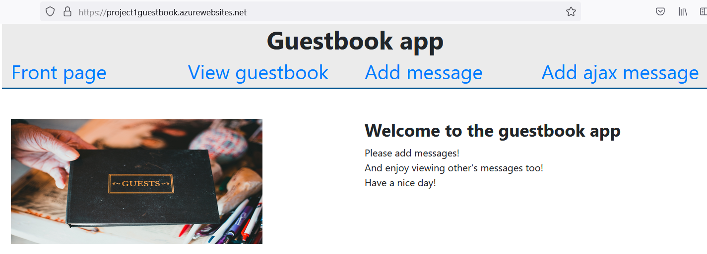
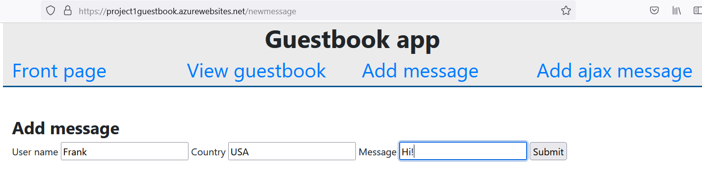
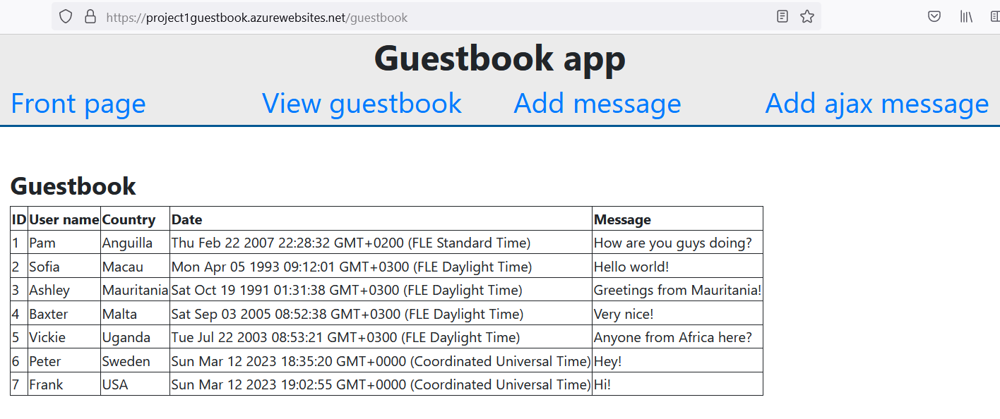

# Project 1: Guestbook
Can be found and used at https://project1guestbook.azurewebsites.net/.

## Purpose of the project
To create an application for the guestbook purposes.

## How to use application
User can view guestbook messages. User can also add a new message to guestbook which will be saved to Azure cloud. If user adds a message with using ajax form, message will not be saved to Azure cloud but only will be viewed at ajax form.

## Status of the project
Ready to use.

## Pictures

